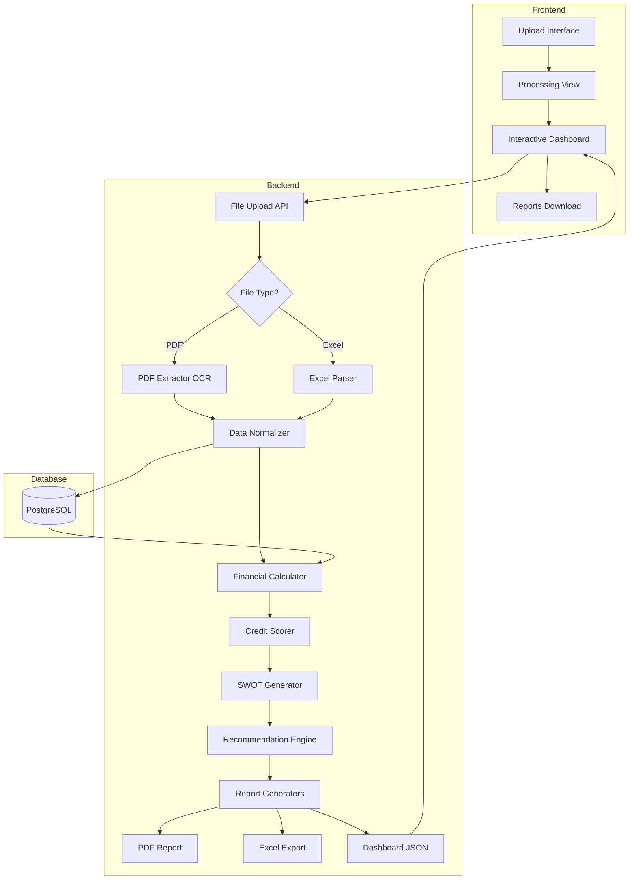

# Implementation Plan - AI Credit Analysis System

## 🎯 Executive Summary

This plan outlines the development of an AI-powered credit analysis system for **Moskalti Capital** to automate SME loan evaluation. The system will analyze financial statements, calculate ratios, assess risk, and provide credit recommendations through an interactive dashboard.

**Key Decision**: Implement **dual-input support** (Excel + PDF) to meet all stated requirements.

---

## ⚠️ User Review Required

> [!CAUTION]
> **Critical Scope Discrepancy Identified**
> 
> The chat history shows PDF extraction was removed on Jan 12, 2026, but the latest project summary (Jan 16) requests PDF input with OCR. This creates conflicting requirements:
> 
> - **Chat Agreement**: Excel upload only (simpler, faster)
> - **Project Summary**: PDF upload with extraction (complex, time-intensive)
> 
> **Recommendation**: Implement **both capabilities** to satisfy all requirements, but this may extend timeline by 2-3 days.
> 
> **Client Must Confirm**: 
> 1. Is PDF extraction truly required, or can we proceed with Excel-only?
> 2. If PDF required, are all PDFs structured (text-based) or do some need OCR?
> 3. Do you have sample PDF financial statements for testing?

> [!IMPORTANT]
> **Credit Scoring Algorithm Clarification Needed**
> 
> To build an accurate recommendation engine, we need:
> - Your current credit scoring methodology and thresholds
> - Risk category definitions (Low/Medium/High)
> - Industry-specific adjustment factors
> - Minimum acceptable ratios for approval
> 
> Without these, we'll implement a generic scoring model that you can customize post-delivery.

> [!WARNING]
> **Timeline Impact**
> 
> Original estimate: **10 working days** for Excel-only system  
> With PDF extraction: **12-13 working days** (may exceed 2-week deadline)
> 
> Budget of $140 USD is tight for this scope. Recommend prioritizing core features first.

---

## 🏗️ Proposed Changes

### System Architecture



---

### Component 1: Backend Infrastructure

#### [NEW] `backend/app/main.py`
FastAPI application entry point with CORS configuration, routing, and middleware setup.

**Implementation**:
- Initialize FastAPI with multi-language support
- Configure CORS for frontend communication
- Set up database connection pooling
- Add request logging and error handling
- Define API versioning structure

---

#### [NEW] `backend/app/models.py`
Database schema for company profiles and analysis results.

**Database Schema**:
```python
CompanyProfile:
  - id (UUID)
  - name (String)
  - industry (String)
  - years_in_business (Integer)
  - fiscal_status (String)
  - created_at (DateTime)

FinancialStatement:
  - id (UUID)
  - company_id (FK)
  - year (Integer)
  - revenue (Decimal)
  - net_profit (Decimal)
  - total_assets (Decimal)
  - total_liabilities (Decimal)
  - current_assets (Decimal)
  - current_liabilities (Decimal)
  - equity (Decimal)

AnalysisResult:
  - id (UUID)
  - company_id (FK)
  - analysis_date (DateTime)
  - liquidity_ratio (Decimal)
  - roe (Decimal)
  - debt_to_assets (Decimal)
  - interest_coverage (Decimal)
  - credit_score (Integer)
  - risk_level (Enum: LOW/MEDIUM/HIGH)
  - recommendation (Enum: APPROVE/CONDITIONAL/REJECT)
  - swot_analysis (JSON)
  - conditions (Text)
```

---

#### [NEW] `backend/app/services/file_processor.py`
Dual-mode file processing for Excel and PDF inputs.

**Excel Processing**:
- Use `pandas` to read Excel files
- Validate expected columns/sheets
- Handle Spanish/English headers
- Extract 3-year financial data

**PDF Processing** (if required):
- Use `pdfplumber` for text-based PDFs
- Implement `Tesseract OCR` for scanned documents
- Train on Spanish/English financial statement formats
- Pattern matching for financial figures
- Validation to achieve ≥98% accuracy requirement

---

#### [NEW] `backend/app/services/financial_calculator.py`
Core financial ratio calculation engine.

**Ratios to Calculate**:
1. **Liquidity Ratios**:
   - Current Ratio = Current Assets / Current Liabilities
   - Quick Ratio = (Current Assets - Inventory) / Current Liabilities
   - Cash Ratio = Cash / Current Liabilities

2. **Profitability Ratios**:
   - ROE = Net Income / Shareholder Equity
   - ROA = Net Income / Total Assets
   - Profit Margin = Net Income / Revenue

3. **Leverage Ratios**:
   - Debt to Assets = Total Debt / Total Assets
   - Debt to Equity = Total Debt / Equity
   - Equity Multiplier = Assets / Equity

4. **Coverage Ratios**:
   - Interest Coverage = EBIT / Interest Expense
   - Debt Service Coverage = Operating Income / Debt Obligations

5. **Trend Analysis**:
   - Revenue growth rate (YoY)
   - Profit growth rate (YoY)
   - Asset turnover trends

---

#### [NEW] `backend/app/services/credit_scorer.py`
AI-powered credit scoring and risk assessment.

**Scoring Components**:
- **Financial Health (40%)**: Weighted average of ratios
- **Growth Trajectory (20%)**: Revenue/profit trends
- **Payment History (20%)**: Historical data (if available)
- **Industry Risk (10%)**: Sector-specific adjustments
- **External Factors (10%)**: Economic conditions

**Risk Categories**:
- **LOW (Score 70-100)**: Strong financials → **APPROVE**
- **MEDIUM (Score 40-69)**: Adequate with concerns → **APPROVE WITH CONDITIONS**
- **HIGH (Score 0-39)**: Weak financials → **REJECT**

**AI Enhancement**:
- Use `LangChain` + `GPT-4` to analyze qualitative factors
- Extract insights from SWOT analysis
- Generate natural language justifications

---

#### [NEW] `backend/app/services/swot_generator.py`
Automated SWOT analysis based on financial data and AI reasoning.

**Logic**:
- **Strengths**: Identify from positive ratios, trends, market position
- **Weaknesses**: Flag high debt, declining revenue, concentration risk
- **Opportunities**: Suggest growth areas, market expansion
- **Threats**: Tax risk, market volatility, competitive pressure

**AI Integration**:
- Use GPT-4 to generate contextual SWOT points
- Translate between Spanish/English automatically
- Reference industry benchmarks

---

#### [NEW] `backend/app/services/report_generator.py`
Multi-format report generation (PDF, Excel, JSON).

**PDF Report** (using `ReportLab`):
- Executive summary page
- Financial ratios table
- 3-year trend charts
- SWOT matrix with color coding
- Recommendation with justification
- Conditions and terms (if applicable)

**Excel Export** (using `openpyxl`):
- Raw financial data (3 years)
- Calculated ratios sheet
- Charts embedded
- SWOT analysis tab
- Recommendation summary

**Dashboard JSON**:
- Structured data for frontend visualization
- Chart-ready data arrays
- Color codes for risk indicators

---

#### [NEW] `backend/app/api/routes.py`
RESTful API endpoints for all operations.

**Endpoints**:
```
POST   /api/v1/upload          - Upload Excel/PDF file
GET    /api/v1/companies       - List all analyzed companies
GET    /api/v1/analysis/:id    - Get analysis results
GET    /api/v1/report/pdf/:id  - Download PDF report
GET    /api/v1/report/excel/:id - Download Excel report
DELETE /api/v1/company/:id     - Delete company profile
POST   /api/v1/settings        - Update scoring thresholds
```

---

### Component 2: Frontend Application

#### [NEW] `frontend/src/App.tsx`
Main React application with routing and state management.

**Routes**:
- `/` - Upload page
- `/processing/:id` - File processing status
- `/dashboard/:id` - Interactive credit analysis dashboard
- `/reports/:id` - Download center

---

#### [NEW] `frontend/src/components/UploadPage.tsx`
File upload interface with drag-and-drop support.

**Features**:
- Drag-and-drop zone for Excel/PDF
- File type validation
- Upload progress indicator
- Multi-language toggle (ES/EN)

---

#### [NEW] `frontend/src/components/Dashboard.tsx`
Interactive dashboard matching the reference mockup design.

**Layout Structure** (as per [Screenshot 2026-01-16 232241.png](file:///d:/FREELANCERS/PAOLAG/CLIENT%20REQUIREMNT%20LIST%20AND%20DETAILS/Screenshot%202026-01-16%20232241.png)):

1. **Header Section**:
   - Company name display
   - Credit risk badge (🔴 HIGH / 🟡 MEDIUM / 🟢 LOW)
   - Payment history status

2. **Left Sidebar - General Information**:
   - Industry tag
   - Years in business
   - Top clients list
   - Fiscal compliance status
   - Document links (clickable)

3. **Center Panel - Financial Indicators**:
   ```
   ┌─────────────────────────────────────────────┐
   │  Liquidity  │  ROE  │ Debt/Assets │ Int Cov │
   │    1.5      │ 12.4% │    55%      │  3.2x   │
   │  Adequate   │Profit │  Moderate   │Acceptable│
   └─────────────────────────────────────────────┘
   ```
   - Color-coded status (Green/Orange/Red)

4. **Right Panel - Financial Charts**:
   - **Revenue & Profit Trend**: 3-year bar chart
   - **Debt/Equity**: Pie chart showing capital structure

5. **SWOT Analysis Section**:
   ```
   ┌──────────────┬──────────────┐
   │ ✅ Strengths │ 🌟 Opportunities │
   │  • Item 1    │  • Item 1    │
   │  • Item 2    │  • Item 2    │
   ├──────────────┼──────────────┤
   │ ⚠️ Weaknesses│ 🚨 Threats   │
   │  • Item 1    │  • Item 1    │
   │  • Item 2    │  • Item 2    │
   └──────────────┴──────────────┘
   ```

6. **Evaluation & Recommendation**:
   - ✅ **APPROVE** / 🟡 **APPROVE WITH CONDITIONS** / ❌ **REJECT**
   - Justification bullets
   - Conditions list (if applicable)
   - Terms: duration, collateral requirements

**Chart Libraries**:
- Use `Recharts` for bar/line charts
- Use `Chart.js` for pie charts
- Implement responsive design for mobile

---

#### [NEW] `frontend/src/components/ReportsPage.tsx`
Download center for PDF and Excel reports.

**Features**:
- Side-by-side preview of PDF
- Download buttons for each format
- Print functionality
- Share via email option

---

### Component 3: Multi-Language Support

#### [NEW] `backend/app/i18n/translations.json`
Spanish and English text mappings for all UI elements and report generation.

**Implementation**:
- Backend: Return translated report content based on `Accept-Language` header
- Frontend: Use `react-i18next` for UI translations
- Support language switching without page reload

---

### Component 4: Deployment

#### [NEW] `Dockerfile`
Multi-stage Docker build for backend and frontend.

```dockerfile
# Backend stage
FROM python:3.11-slim as backend
WORKDIR /app
COPY backend/requirements.txt .
RUN pip install --no-cache-dir -r requirements.txt
COPY backend/ .
CMD ["uvicorn", "app.main:app", "--host", "0.0.0.0", "--port", "8000"]

# Frontend stage
FROM node:18-alpine as frontend
WORKDIR /app
COPY frontend/package*.json ./
RUN npm install
COPY frontend/ .
RUN npm run build

# Nginx stage
FROM nginx:alpine
COPY --from=frontend /app/dist /usr/share/nginx/html
COPY nginx.conf /etc/nginx/nginx.conf
```

---

#### [NEW] `docker-compose.yml`
Orchestrate backend, frontend, and database services.

```yaml
version: '3.8'

services:
  db:
    image: postgres:15-alpine
    environment:
      POSTGRES_DB: credit_analysis
      POSTGRES_USER: moskalti
      POSTGRES_PASSWORD: ${DB_PASSWORD}
    volumes:
      - postgres_data:/var/lib/postgresql/data

  backend:
    build:
      context: .
      dockerfile: Dockerfile
      target: backend
    ports:
      - "8000:8000"
    depends_on:
      - db
    environment:
      DATABASE_URL: postgresql://moskalti:${DB_PASSWORD}@db:5432/credit_analysis
      OPENAI_API_KEY: ${OPENAI_API_KEY}

  frontend:
    build:
      context: .
      dockerfile: Dockerfile
      target: frontend
    ports:
      - "3000:80"
    depends_on:
      - backend

volumes:
  postgres_data:
```

---

### Component 5: Documentation

#### [NEW] `docs/USER_GUIDE.md`
End-user documentation in Spanish and English.

**Sections**:
- System overview
- How to upload financial statements
- Understanding the dashboard
- Interpreting credit recommendations
- Downloading reports
- Troubleshooting

---

#### [NEW] `docs/TECHNICAL_DOCS.md`
Developer documentation for maintenance and extension.

**Sections**:
- Architecture overview
- API reference
- Database schema
- Deployment instructions
- Configuration parameters
- Extending the credit scoring algorithm

---

## 🧪 Verification Plan

### Automated Tests

#### Unit Tests
```bash
# Backend tests
cd backend
pytest tests/ --cov=app --cov-report=html

# Tests to cover:
# - Financial ratio calculations (test_financial_calculator.py)
# - Credit scoring logic (test_credit_scorer.py)
# - Excel parsing (test_file_processor.py)
# - PDF extraction accuracy if implemented (test_pdf_extractor.py)
# - SWOT generation (test_swot_generator.py)
```

**Target**: ≥85% code coverage

---

#### Integration Tests
```bash
# API endpoint tests
pytest tests/integration/ -v

# Tests to cover:
# - File upload endpoint
# - Analysis retrieval
# - Report generation
# - Error handling
```

---

#### Frontend Tests
```bash
cd frontend
npm run test

# Component tests using React Testing Library:
# - Upload form validation
# - Dashboard rendering with mock data
# - Chart rendering
# - Language switching
```

---

### Manual Verification

#### Test Case 1: Excel Upload Flow
1. Start application: `docker-compose up`
2. Navigate to `http://localhost:3000`
3. Upload sample Excel file: `Ejemplo para hacer un analisis.xlsx`
4. Verify processing completes within 30 seconds
5. Check dashboard displays all sections correctly
6. Validate financial ratios match manual calculations
7. Download PDF report and verify content
8. Download Excel export and cross-check figures
9. **Expected**: All outputs show identical numbers

---

#### Test Case 2: Multi-Language Support
1. Set browser language to Spanish
2. Upload financial statement
3. Verify dashboard is in Spanish
4. Download PDF report → should be in Spanish
5. Switch language to English via toggle
6. Verify UI updates to English
7. Download new report → should be in English
8. **Expected**: Seamless language switching

---

#### Test Case 3: Credit Recommendation Accuracy
Use 3 test cases with known expected outcomes:

**Case A: Strong Company (Expected: APPROVE)**
- Liquidity: 2.5
- ROE: 18%
- Debt/Assets: 30%
- Interest Coverage: 5x
- Revenue growth: +15% YoY

**Case B: Moderate Company (Expected: APPROVE WITH CONDITIONS)**
- Liquidity: 1.2
- ROE: 10%
- Debt/Assets: 65%
- Interest Coverage: 2.5x
- Revenue growth: +3% YoY

**Case C: Weak Company (Expected: REJECT)**
- Liquidity: 0.8
- ROE: 3%
- Debt/Assets: 85%
- Interest Coverage: 1.1x
- Revenue growth: -5% YoY

**Validation**: System must correctly classify all 3 cases.

---

#### Test Case 4: PDF Extraction (If Implemented)
1. Upload sample PDF: `Financial statements - EXAMPLE PDF.pdf`
2. Let OCR process complete
3. Compare extracted figures against source PDF
4. **Expected**: ≥98% accuracy as per acceptance criteria
5. Verify SWOT and recommendations are consistent with Excel-based analysis

---

### Performance Testing
```bash
# Load test with Apache Bench
ab -n 100 -c 10 http://localhost:8000/api/v1/upload

# Expected: 
# - Response time < 2 seconds for upload
# - Analysis completion < 30 seconds
# - No memory leaks under load
```

---

### User Acceptance Testing (UAT)
1. Share staging deployment with client
2. Client uploads 3 real company profiles
3. Validate recommendations against their manual analysis
4. Gather feedback on UI/UX
5. Iterate on scoring thresholds if needed

---

## 📅 Development Timeline

### Week 1 (Days 1-5)
- **Day 1**: Project setup, database schema, file upload API
- **Day 2**: Excel parser, financial calculator
- **Day 3**: Credit scorer, SWOT generator, recommendation engine
- **Day 4**: PDF extractor (if required), data validation
- **Day 5**: Report generators (PDF, Excel, JSON)

### Week 2 (Days 6-10)
- **Day 6**: Frontend setup, upload component, routing
- **Day 7**: Dashboard design (matching mockup)
- **Day 8**: Charts integration, SWOT display, language toggle
- **Day 9**: Reports page, downloads, testing
- **Day 10**: Bug fixes, Docker deployment, documentation

**Contingency**: +2-3 days if PDF extraction with OCR is complex

---

## 🔑 Technology Justification

### Why FastAPI?
- High performance (async support)
- Auto-generated API docs (Swagger UI)
- Easy integration with ML/AI libraries
- Built-in validation with Pydantic

### Why React + TypeScript?
- Component reusability
- Type safety reduces bugs
- Rich ecosystem for charts (Recharts, Chart.js)
- Easy internationalization (i18next)

### Why PostgreSQL?
- Robust relational database
- JSON field support for SWOT storage
- Great Python integration via SQLAlchemy
- Free and open-source

### Why Docker?
- Environment consistency
- Easy deployment
- Scalable architecture
- Client can deploy anywhere (cloud/on-premise)

---

## 📋 Pre-Development Checklist

Before starting implementation, confirm with client:

- [ ] Final decision on PDF vs Excel input (or both)?
- [ ] Sample financial statements for testing
- [ ] Current credit scoring criteria and thresholds
- [ ] Industry-specific ratio adjustments needed?
- [ ] Preferred hosting environment
- [ ] Access to any existing systems for integration
- [ ] Timeline flexibility if scope includes PDF extraction

---

## 🚀 Next Steps

Once this plan is approved:

1. **Immediate**: Clarify scope questions with client
2. **Day 1**: Set up repository structure and Docker environment
3. **Week 1**: Backend development and core logic
4. **Week 2**: Frontend development and integration
5. **Final**: Testing, deployment, and handover

**Ready to begin upon your approval!** 🎯
